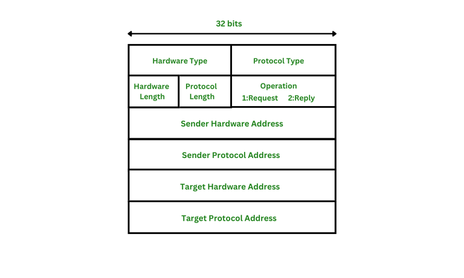

# NJam
**NJam** is a simple network jamming tool written in C that disrupts local network traffic by performing **ARP spoofing**. This technique allows you to poison the ARP cache of devices on a network, redirecting their traffic to the wrong MAC address (yours).
The inspiration for this project came from the `arpspoof` tool, which works well but is limited to targeting a single device at a time. NJam was created to scale this attack and disrupt entire networks more effectively.
# How does it work
NJam performs **ARP spoofing**, which relies on the fundamental behavior of the ARP protocol.

> ARP (Address Resolution Protocol) is used to map IP addresses to MAC addresses on a local network.

Here's an example structure of an ARP packet:

1. **Hardware Type**  
   Defines the type of hardware at the link layer.  
   - Common value: `0x0001` for Ethernet.

2. **Protocol Type**  
   Defines the upper-layer protocol.  
   - Common value: `0x0800` for IPv4.

3. **Hardware Length**  
   Length in bytes of the hardware address.  
   - Common value: `6` (for MAC address).

4. **Protocol Length**  
   Length in bytes of the protocol address.  
   - Common value: `4` (for IPv4 address).

5. **Operation Code**  
   Indicates the type of ARP message:  
   - `1` – ARP Request  
   - `2` – ARP Reply  
   - Rare values: Reverse ARP, InARP, etc.

6. **Addresses**
   - **Sender Hardware Address (SHA):** MAC address of the sender (spoofed in our case).
   - **Sender Protocol Address (SPA):** IP address of the sender (spoofed to appear as a legitimate device).
   - **Target Hardware Address (THA):** MAC address of the device we are targeting.
   - **Target Protocol Address (TPA):** IP address of the target device.

## ARP Spoofing Logic

1. **Discovery Phase:**  
   Get MAC addresses of the router and target device using ARP requests.

2. **Spoofing Phase:**  
   Send crafted ARP *reply* packets:
   - One with the sender IP of the **router** and our **MAC address** to the **target**.
   - One with the sender IP of the **target** and our **MAC address** to the **router**.

> In both cases, we trick each side into associating our MAC with the IP of the other side.

3. **Effect:**  
   Packets intended for the router or target are instead sent to our device, allowing for disruption or potential man-in-the-middle attacks.

## Project structure

- `src/` – C source files
- `include/` – C header files 
- `packaging/` – Packaging used for .deb
- `images/` – Diagrams and packet structure
- `build.sh` – Executable script to build project